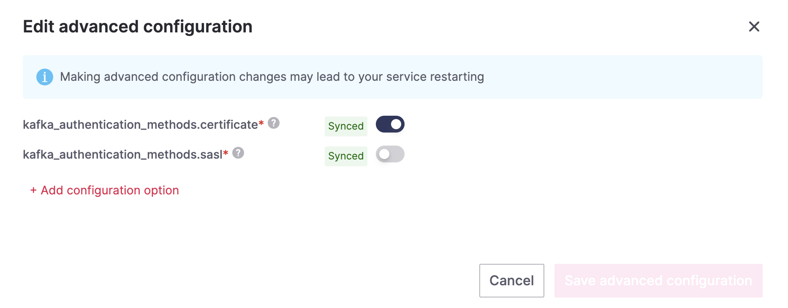

# Creating a Kafka Service using Aiven Console

Aiven provides a user-friendly web-based console to manage and deploy various cloud services, including Apache Kafka. This guide will walk you through the steps to create a Kafka service using the Aiven console.

## Prerequisites

- A valid Aiven account
- Access to the Aiven console

## Steps to Create a Kafka Service

1. Open your web browser and navigate to the [Aiven console](https://console.aiven.io/).
2. Sign in to your Aiven account using your credentials.
   - If you don't have yet an Aiven account, please refere to [Create Aiven Account](NewAccountAiven.md)
3. Once logged in, you will be presented with the Aiven console dashboard. Click on the "Create Service" button at the top right.
    

4. On the "Select Service Type" page, choose "Apache Kafka" from the list of available services.
   

5. Specify the following details for your Kafka service:
   - **Service name**: Enter a unique name for your Kafka service.
   - **Cloud**: Select the cloud provider where you want to deploy your Kafka service (e.g., AWS, Google Cloud, Azure).
   - **Region**: Choose the desired region or data center location for your Kafka service.
   - **Plan**: Select the desired plan based on your requirements (e.g., Startup, Business, Premium).
   - **Number of Nodes**: Specify the number of Kafka broker nodes you want to deploy.
   - **Access Control**: Choose the authentication method for accessing your Kafka service (e.g., Password, TLS/SSL, SCRAM-SHA-256).
   - **Tags** (optional): Add any relevant tags to help organize and manage your services.
    

6. After providing the necessary details, click on the "Create Service" button to initiate the Kafka service creation process.
7. Aiven will provision and deploy your Kafka service. This may take a few minutes.
8. Once the Kafka service is successfully created, you will be redirected to the service overview page. Here, you can find important information such as connection details, credentials, and monitoring options for your Kafka service.
   

9. Make note of the connection details, such as the **Bootstrap URL**, **Port**, and **SSL/TLS options**, as you will need these to interact with your Kafka cluster.
10. Congratulations! You have successfully created a Kafka service using the Aiven console.

## Extra Steps for our tutorial

1. Enable REST API
  To view Kafka messages from Aiven console, we need to enable the Kafka REST API first.
   
   
2. To produce events to a Kafka Topic, the topic should exist first, or the kafka parameter kafka.auto_create_topics_enable should be enabled.
To enable this setting, on kafka Overview tab, go down and look for **Advanced configuration**
   - Hit the "Change" button
     
   
   - Click on "+ Add configuration option"
   - Add the option "kafka.auto_create_topics_enable" and enable it
     
   
   - Finally, click on "Save advanced configuration"
     
     

## Conclusion

By following these steps, you can easily create a Kafka service using the Aiven console. Aiven simplifies the process of deploying and managing Kafka clusters, allowing you to focus on building scalable and reliable data streaming applications.

In another tutorial [Create Kakfa Service Using Aiven CLI](CreateKafkaService.md), we walk through the steps on how to use Aiven CLI to create a Kafka Service.

Once your Kafka service is up and running, you can start leveraging its powerful features, such as message publishing and consuming, stream processing, and real-time data analytics.

Happy Kafka-ing with Aiven!

---