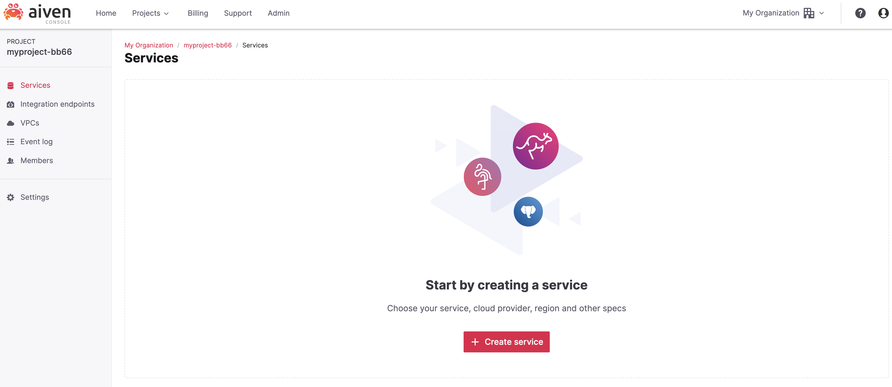

# Creating a Trial Account on Aiven

Aiven provides managed cloud services for popular open-source data technologies. To get started with Aiven and experience our offerings, you can create a trial account. This guide will walk you through the process of signing up for a trial account on Aiven.
Aiven offer a free 30-day trial and up to $300 free credits.

## Prerequisites

- Internet connection
- Valid email address
- **No credit card needed**
- **No cloud account needed**
- **No install needed**

Just sign up and you’re good to go.

## Steps to Create a Trial Account

1. Open your web browser and navigate to the [Aiven website](https://aiven.io/).
2. Click on the "Get started for free" on the homepage.
   

3. select "Sign up with Google"
   - If you prefer to use your GitHub account for authentication, click on the "Sign up with GitHub" button and follow the prompts to authorize Aiven's access to your GitHub account.
   - Aiven support also Microsoft account authentication
   
3. Fill in the required information in the sign-up form, and the click "Done"
   
   - Organization name`: the name of your organizarion, this can be changed later
   - `Project name`: the name of your project`
4. Congratulations! You have successfully created a trial account on Aiven
   - Now, you are on the home page and you can start creating open source services on the cloud.
   

## Conclusion

By following these steps, you can easily create a trial account on Aiven and start exploring our managed cloud services for data technologies such as Kafka, PostgreSQL, Elasticsearch, and more.

Now that you have your trial account, you can begin provisioning and using Aiven services to deploy, manage, and scale your favorite open-source data tools in the cloud.

Happy exploring and building with Aiven!

---
