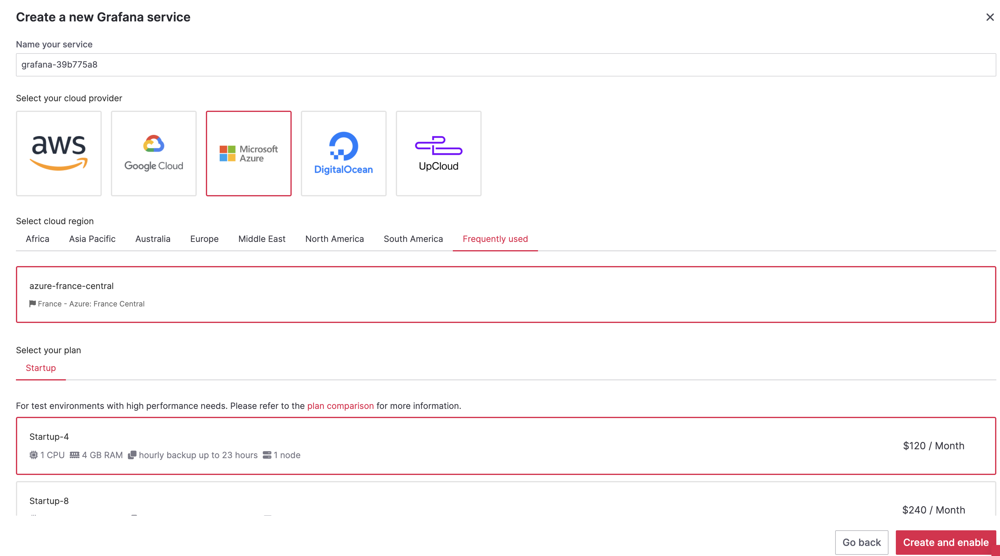
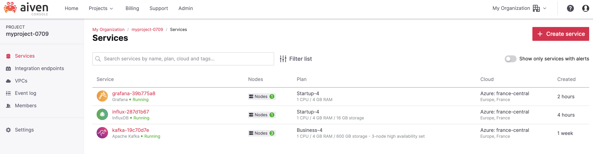
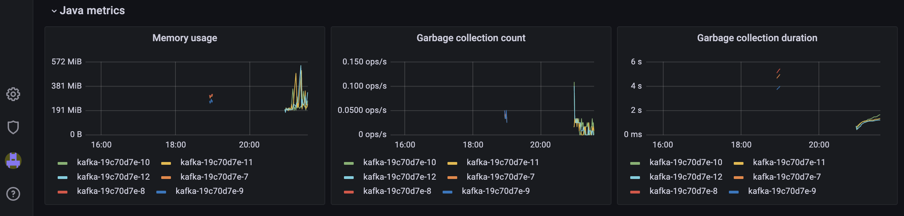
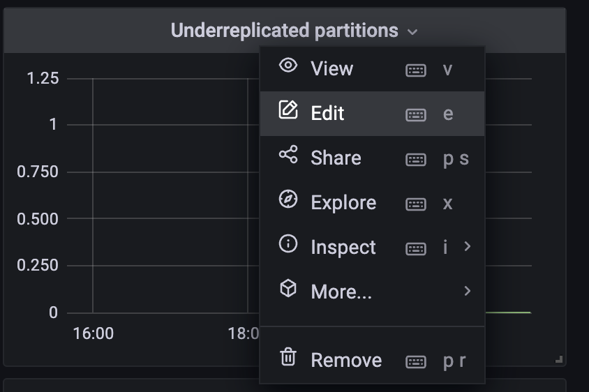

# Working with Aiven Kafka and Observability

In this tutorial, we will explore how to work with Aiven Kafka and utilize its observability features to gain insights into your Kafka cluster's performance and health. Aiven is a fully managed cloud service that provides Kafka as a service, making it easy to set up and manage Kafka clusters in the cloud.

## Prerequisites

To follow along with this tutorial, you will need the following:

- An Aiven account:
  - If you don't have yet an Aiven account, you can create a free account by following [Create Aiven Account](NewAccountAiven.md)
- Access to an Aiven Kafka service:
  - An Apache Apache Kafka cluster can be created in minutes in any cloud of your choice using [Aiven.io console](https://console.aiven.io/signup?utm_source=github&utm_medium=organic&utm_campaign=blog_art&utm_content=post).
  - To create a managed Kafka service, you can follow the steps on this tutorial [Create Kakfa Service](CreateKafkaService.md)
  - If you already have a Kafka Service running on your Aiven platform, make sure you configured those extra Kafka settings: [Advanced Kafka Settings](CreateKafkaService.md#Extra-Steps-for-our-tutorial)
- Kafka command-line tools (to interact with Kafka)

## Description

* **Apache Kafka**: an open source [distributed streaming platform](https://kafka.apache.org/)
* **Topic**: all Apache Kafka records/messages are organised into topics, you can think of a topic like an event log or a table if you're familiar with databases.
* **Apache Kafka Producer**: an process or application that publishes data to Apache Kafka
* **Apache Kafka Consumer**: an process or application that consume data from one or multiple Kafka Topics.


## Step 1: Install Kafka Producer prerequisites
This demo app is relying on [Faker](https://faker.readthedocs.io/en/master/) and [kafka-python](https://kafka-python.readthedocs.io/en/master/usage.html) which the former requiring Python 3.5 and above.
The installation can be done via

```bash
pip install -r requirements.txt
```

## Step 2: Produce IoT mock events to Kafka
In this use case, we are simulating an IoT environment where multiple sensors collect data in real-time. We want to generate mock events from these sensors and stream them to Kafka for further processing and analysis. The mock events represent sensor readings such as temperature, humidity and timestamp data.

Using Python and the Faker library, we generate realistic sensor data with random values for each event. The events include a timestamp in ISO 8601 format, an UUID field for identifying the sensor, temperature and humidity information, and additional sensor-specific data such as time of the event. We leverage the power of Faker's data generation capabilities to ensure the events are diverse and representative of real-world sensor data.

By producing these IoT mock events to Kafka, we create a stream of data that can be consumed and processed by downstream applications. This use case allows us to test and validate the performance, scalability, and reliability of our Kafka infrastructure in handling high volumes of IoT data. Additionally, it enables us to develop and fine-tune data processing pipelines, analytics, and machine learning models that rely on real-time sensor data.
### Usage

The Python code can be run in bash with the following,

in ``SSL`` security protocol:
```bash
python main.py \
  --security-protocol ssl \
  --cert-folder ./kafkaCerts/SensorIoT/ \
  --host kafka-19c70d7e-myproject-0709.aivencloud.com \
  --port 26430 \
  --topic-name sensor_metrics \
  --nbr-messages 200 \
  --max-waiting-time 1 
```
in ``SASL_SSL`` security protocol:
```bash
python main.py \
  --security-protocol SASL_SSL \
  --sasl-mechanism SCRAM-SHA-256 \
  --username <USERNAME> \
  --password <PASSWORD> \
  --cert-folder ./kafkaCerts/SensorIoT/ \
  --host kafka-19c70d7e-myproject-0709.aivencloud.com \
  --port 26430 \
  --topic-name sensor_metrics \
  --nbr-messages 200 \
  --max-waiting-time 1 
```
in ``PLAINTEXT`` security protocol:
```bash
python main.py \
  --security-protocol plaintext \
  --host your-kafka-broker-host \
  --port 9092 \
  --topic-name sensor_metrics \
  --nbr-messages 200 \
  --max-waiting-time 1 
```
Where
* `security-protocol`: Security protocol for Kafka. ``PLAINTEXT``,  ``SSL`` or ``SASL_SSL`` are supported.
* `cert-folder`: points to the folder containing the Apache Kafka CA certificate, Access certificate and Access key
* `host`: the Apache Kafka host
* `port`: the Apache Kafka port
* `topic-name`: the Apache Kafka topic name to write to.
* `nbr-messages`: the number of messages to send
* `max-waiting-time`: the maximum waiting time in seconds between messages

If successfully connected to a Apache Kafka cluster, the command will output a number of messages (`nbr-messages` parameter) that are been sent to Apache Kafka in the form

```json
{
   "sensor_uuid":"f149f542-e935-4870-9734-6b4501eaf614",
   "timestamp":"2023-05-17T18:48:27.007843",
   "temperature":29.597442428305666,
   "humidity":47.62930396701411
}
```

With
* `sensor_uuid`: a random uuid identifying the sensor.
* `timestamp`: the timestamp of the event, represented by a string with the date in ISO 8601 format.
* `temperature`: the temperature measurement displayed by the sensor.
* `humidity`: the humidity measurement displayed by the sensor.

## Step 3: Consume kafka topic using Aiven console
First, make sure you enable the Kafka REST API as described in this documentation: [Advanced Kafka Settings](CreateKafkaService.md#Extra-Steps-for-our-tutorial)

To fetch messages from a Kafka topic using the Aiven console, follow these steps:
1. On the kafka service overview page, you will see various tabs, including "Topics." Click on the "Topics" tab.
2. A list of topics associated with your Kafka service will be displayed. Find the specific topic from which you want to fetch messages and click on it. In our case it's "sensor_metrics" topic.
3. Click on "Fetch messages", and be sure to enable "Decode from base64", so you can decode the value and message contents.


Congratulations! You have successfully created a Kafka managed service, produced faked IoT events, and consume those event using Aiven platform.
In the next section, we will see how to address kafka blindness using Aiven monitoring tools.

# Working with Aiven Kafka and Observability: Integrating with InfluxDB and Grafana

Observability is crucial for effectively managing and monitoring your Kafka infrastructure. In addition to the built-in monitoring capabilities provided by Aiven Kafka, you can further enhance your observability by integrating with external tools like InfluxDB and Grafana. In this article, we will explore how to integrate Kafka with InfluxDB for metric storage and use Grafana to create powerful monitoring dashboards.


## Step 1: Integrating Kafka with InfluxDB

InfluxDB is a time-series database designed for high-performance storage and retrieval of time-stamped data. By integrating Kafka with InfluxDB, you can store Kafka metrics and other observability data in InfluxDB for long-term storage and analysis.

By integrating Kafka with InfluxDB, you can leverage InfluxDB's powerful query capabilities and visualization tools to gain deeper insights into the behavior and performance of your Kafka clusters over time.
To integrate Kafka with InfluxDB follow these steps:
1. On your Kafka service, click on the "Integrations" tab.
2. From the the liste of "Aiven solutions", choose "Store Metrics"


3. Chose "New service" to create a new InfluxDB servicee.

4. Name your influxDB service, and choose a cloud provider


5. Choose a Service plan, for our demo you can choose the "Startup-4" plan.
6. Finally, click on "Create and enable", wait a few minutes so Aiven backend provision the service.

7. Congratulations, your influxDB service managed by Aiven is running

## Step 2: add Grafana Service
Grafana by Aiven is a powerful data visualization and monitoring platform that allows you to create interactive dashboards, analyze metrics, and gain valuable insights from your data. It seamlessly integrates with various data sources, including databases, time series databases, and cloud services, making it a versatile tool for visualizing and monitoring your data.

With Grafana by Aiven, you can connect to your data sources, such as InfluxDB, Elasticsearch, PostgreSQL, and more, and create visually appealing dashboards that present your data in a meaningful way. You can customize the dashboards with a wide range of visualization options, including graphs, charts, tables, and gauges, to effectively communicate trends, patterns, and anomalies.

1. On the influxDB service hompe page, click on "Integrations" tab.


2. From "Aiven solutions", select "Grafana Metrics Dashboard"
3. We don't have any Grafana service running yet, so choose "New servcie" to create one.

4. As we did for the influxDB service, choose your cloud provider and your service plan. 
   You can stick to the "startup-4" plan for demo purposes.

   
5. In few minutes, your Grafana service should be up and running

   
6. If you click on the Grafana service, on the "Overview" tab, you can fin all the required information to connect to Grafana.


7. Click on the "Service URI" link


8. Use the username "avnadmin" and the password from the "Overview" section to authenticate.

9. Congratulations! You have successfully created a Grafana service using the Aiven.


## Step 3:  Creating Monitoring Dashboards with Grafana

Grafana is a popular open-source platform for creating rich visualizations and dashboards. 
By integrating Kafka with Grafana, you can create custom monitoring dashboards that provide real-time insights into your Kafka infrastructure.

To create monitoring dashboards with Grafana:
1. Use the search loupe on the top left, and look for datshboard with name "AivenKafka-<kafka-serviceName>-Resources", and then click on it.


2. System dashbaords
  The usual host-level resource metrics, such as CPU, Memory, Network and disk usage.
  


3. Kafka dashboards
Kafka-specific metrics about brokers, message activity, etc.
  
   
  Some kafka specific metrics are:
  * **Kafka messages in** : The metric 'Kafka messages in' signifies the rate of incoming messages per second that are transmitted to the Kafka brokers. This metric plays a crucial role in comprehending the minimum, maximum, and average message throughput generated by your application and flowing through Kafka.
    
  
    These statistics provide valuable insights into the overall volume of data being processed, enabling you to assess the system's performance and capacity. By correlating these metrics with other external factors like the number of active users, the quantity of managed IoT devices, and other relevant parameters, you can enhance your capacity planning and make informed decisions for future scalability and resource allocation.
  * **Fetch requests** and **Kafka failed fetch requests** : The metrics 'Fetch requests' and 'Kafka failed fetch requests' provide insights into the rate of successful and failed fetch requests per second in Kafka, respectively.
    Ideally, the number of failed fetch requests should be zero during normal operations. However, if this metric exceeds zero, it indicates that requests are being dropped due to the internal buffers depleting their available resources. This could be an indicator of potential issues and may require investigation and optimization to ensure the smooth and uninterrupted flow of data within the Kafka system.
    
  * **Kafka under-replicated partitions** : The metric 'Kafka under-replicated partitions' reflects the number of partitions in Kafka that are currently under-replicated.
    Ideally, this number should be zero under normal circumstances. However, in certain situations, Kafka may actively work to reach the specific replication factor for certain topic partitions, resulting in temporarily under-replicated partitions. These situations can occur when users adjust replication factors, during cluster migrations or upgrades, or when maintenance updates are being applied.
    If the count of under-replicated partitions remains consistently greater than zero for an extended period, it indicates that replicas are not fully synchronized. This could be an indication of a problem, such as a hardware failure on one of the brokers. Aiven's self-healing automation takes care of such issues by automatically launching new virtual machines (VMs) to replace any failed ones and ensuring their synchronization with the cluster.
    
4. JVM dashboards
  Internal metrics from the JVM that runs the Kafka processes.
  

##  Step 4: Creating Alerting rules using Grafana
By leveraging Grafana's rich visualization options and alerting capabilities, you can create tailored monitoring dashboards that help you track the health, performance, and behavior of your Kafka infrastructure in real-time.

1. Choose a metric panel, and then click "Edit". In this example we want to create alerts based on "Underreplicated partitions" metric.


2. In the Alert tab for the graph, and then under the Alert config subsection, pick the entries shown below.


3. Click "Save and exit"


# Conclusion

In this tutorial, we explored the process of working with Aiven Kafka and utilizing its observability features. We created a Kafka service, connected to it using the Kafka command-line tools, and demonstrated how to monitor the Kafka cluster's performance and health through metrics, logs, and alerts provided by Aiven.

Aiven's observability features enable you to gain valuable insights into your Kafka cluster, troubleshoot issues, and ensure its smooth operation. By leveraging these features, you can effectively manage and monitor your Kafka infrastructure.

Start exploring Aiven Kafka's observability capabilities today and harness the power of real-time monitoring and proactive alerting for your Kafka-based applications.

Happy Kafka-ing!


---
